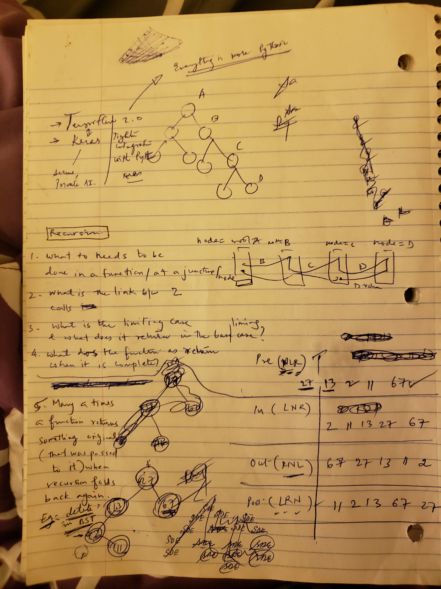

# Programming Notes on Trees (BST, AVL etc.)
We will note behaviors of some common tasks. These behaviors are common to both BST and AVLs

**1. Insert or Delete high level structure:**

	 private Node insert or delete (Node node, int data) {
		
	// 1. Perform the normal BST insertion
		
		/*
		 * Note: Duplicate keys not allowed. To allow duplicate keys, we could have
		 * added equals sign i.e <= or >= when comparing data with the node.
		 */
		 
		if ((node != null) && (data < node.getData())) {
			// go left
			node.setLeftNode(insert(node.getLeftNode(), data));
		}
		
		else if ((node != null) && (data > node.getData())) {
			// go right
			node.setRightNode(insert(node.getRightNode(), data));
		}
		
		else {
		
		// insert and return or  if it is delete function, then delete and return
		}
		
	// 2. Update height if reqd. in the program
		node.setHeight(Math.max(height(node.getLeftNode()), height(node.getRightNode())) + 1);
		
		
	// 3. Settle Violations
		
		/* Important Notes-
		 * 
		 * Call settleViolations. Note that, we are starting to settle violations from
		 * the parent and up i.e first call to settleViolation will have the parent of
		 * inserted node going in. Ideally we should have started from grandparent and
		 * up. But its fine.
		 * 
		 * Once inside, settleViolations you will see that the ingoing node assumes
		 * grandfather position in the arrangement in terms of balance checking and
		 * LL/LR/RR/RL case checking.
		 * 
		 * Also, very important - Don't return node. Return what you got after settling
		 * the violations. That is now the correct child of the previous caller node
		 * will be set. We do this by assigning the return value of settleViolations to
		 * the current node, and then returning the current node.
		 */
		
		node = settleViolations(node);
		
		// return the node
		return node;
		}
		

**2. BST Delete once the Node is reached, eg. from 1. :**

Once the node is reached, delete basically has 3 cases-

Case1 : Matching node has no children
Case2 : Matching node has 1 child
Case3 : Matching node has 2 children

All 3 cases return with different nodes after deleting the matching node. This is ver important note.

**3. RightRotate and LeftRotate :**
They perform rotations and they return the **new root** of the group.

**4.settleViolations(node) or reBalance(node)**
The first node to go in this function is the Parent of the inserted or the deleted node.
But once inside this  settleViolations(node) or reBalance(node) function, this ingoing node acts as the grandfather in the LL/LR/RR/RL arrangement.

So this function -
1. Checks the balance of **node**   getbalance() helper method checks the balance upto this node. 
Note: Balance is checked and corrected for each node, for which settleViolations is called from the insert/delete recursion that is folding back up. This is how we make sure the entire tree from bottom to top is balanced. 

2. Calls Right/ Left rotations depending on the LL/LR/RR/RL cases.

3. Returns this **node**.

This **node** must be set as the current node in insert/delete functions which  called the settleViolations function.

