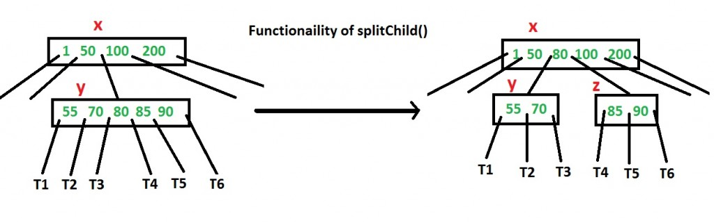

# BTree

For the most part, like Red Black trees, we will avoid bringing up B Trees **coding** in the interviews. Because the implementation is long and requires understanding/thinking of some rules.
You can and should use the concepts however.

Here we have attempted to understand BTrees, perform traversal, search, and even insertion using the Reactive algorithm.

We have not performed deletion because of the complexity of implementation. But deletion can also be done later.

- https://www.youtube.com/watch?v=aZjYr87r1b8&feature=emb_title

In the BTree Class -

	public class BTree {
		private Node root = null;
		private static int T = 2;// we can change the degree to something else also.
	

In the Node class -

	static class Node {	
	// 2) A B-Tree is defined by the term minimum degree ‘t’. The value of t depends
		// upon disk block size.
		int currentSizeOfNode; // Current number of keys in the node. How full is the dataArray.
		int maxSizeOfNode = 2 * T - 1;
		// maxSizeOfNode = 2*T -1
		// M= maxSizeOfNode = maxSizeOfNode+1= 2*T-1+1= 2*T
		// i.e maximum number of child nodes = M
		// and max number of keys in a node = M-1
		int dataArray[] = new int[maxSizeOfNode]; // 4) All nodes (including root) may contain at most 2t – 1 keys.
		Node[] childrenNodes = new Node[maxSizeOfNode + 1]; // 5) Number of children of a node is equal to the
															// number of keys in it plus 1. i.e (2t-1)+1=2t
		boolean isLeaf; // Is true when node is leaf i.e it has no children. Otherwise false

https://www.youtube.com/watch?v=aZjYr87r1b8&feature=emb_title

## Relation between M-way trees and BTrees

Clipped Video- But watch full video to understand use of BTrees in Multilevel indexing.

- https://www.youtube.com/embed/aZjYr87r1b8?controls=0&amp;start=1515&end=1640

## Introduction

https://www.geeksforgeeks.org/introduction-of-b-tree-2/

## Insertion

Refer to https://www.geeksforgeeks.org/insert-operation-in-b-tree/

In this post, insert() operation is discussed. A new key is always inserted at the leaf node. Let the key to be inserted be k. Like BST, we start from the root and traverse down till we reach a leaf node. Once we reach a leaf node, we insert the key in that leaf node. Unlike BSTs, we have a predefined range on the number of keys that a node can contain. 

##### REACTIVE SPLITTING ALGORITHM:

- https://www.youtube.com/watch?v=KdbFmwRvkvg

WE HAVE IMPLEMENTED REACTIVE SPLITTING. We don't do unnecessary splits first. Only when required.
Or in other words, we first go to recursively insert. The we check the Split result. And then satisfy the Splitresult case.

See this behaviour here in a snippet from the insert() function - 

		for (; i < root.currentSizeOfNode; i++) {
					if (data <= root.dataArray[i]) {
						// if data is less than the key, go to that numbered corresponding child, and
						// recurse on insert
						SplitResult sr = insert(root.childrenNodes[i], data);
						if (sr == null) { // SplitResult can be null here, when it hits a childless node on the next
											// iteration above which is not full. See the first 'if condition.'
							return null; // return null in that case
						} else { // if we get back a SplitResult, then make insertKey call
							if (!root.isFull()) {
								// if not full, insert data and return null
								root.insertKey(sr.c, sr.r1, sr.r2);
								return null;
							} else {
								// else splitting the node is needed again.
								SplitResult sr1 = splitNode(root, sr.c, sr.r1, sr.r2);
								return sr1;
							}
						}
					}
				}

---------

Proactive algorithm would have meant we refuse to go down to a node, until first checking if it is full or not and then, splitting it if it is full.

In a Proactive Splitting algorithm,  before inserting a key to the node, we make sure that the node has extra space.

How to make sure that a node has space available for a key before the key is inserted? We use an operation called splitChild() that is used to split a child of a node. See the following diagram to understand split. In the following diagram, child y of x is being split into two nodes y and z. Note that the splitChild operation moves a key up and this is the reason B-Trees grow up, unlike BSTs which grow down.

##### PROACTIVE SPLITTING ALGORITHM:

As discussed above, to insert a new key, we go down from root to leaf. Before traversing down to a node, we first check if the node is full. If the node is full, we split it to create space. Following is the complete algorithm.

Note that the following algorithm follows the Cormen book. **It is actually a proactive insertion algorithm where before going down to a node, we split it if it is full.** The advantage of splitting before is, we never traverse a node twice. If we don’t split a node before going down to it and split it only if a new key is inserted (reactive), we may end up traversing all nodes again from leaf to root. This happens in cases when all nodes on the path from the root to leaf are full. So when we come to the leaf node, we split it and move a key up. Moving a key up will cause a split in parent node (because the parent was already full). This cascading effect never happens in this proactive insertion algorithm. 

There is a disadvantage of this proactive insertion though, we may do unnecessary splits.

	1) Initialize x as root.
	
	2) While x is not leaf, do following
	
	..a) Find the child of x that is going to be traversed next. Let the child be y.
	
	..b) If y is not full, change x to point to y.
	
	..c) If y is full, split it and change x to point to one of the two parts of y. If k is smaller than mid key in y, then set x as the first part of y. Else second part of y. When we split y, we move a key from y to its parent x.
	
	3) The loop in step 2 stops when x is leaf. x must have space for 1 extra key as we have been splitting all nodes in advance. So simply insert k to x.

## Deletion
 Deletion Not discussed in this code.
 
 But Refer to https://www.geeksforgeeks.org/delete-operation-in-b-tree/ for Algorithm and C++ code