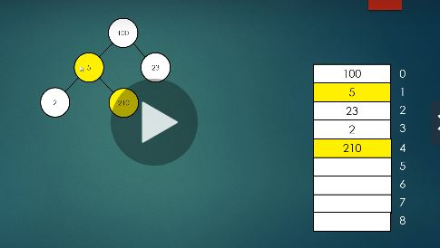
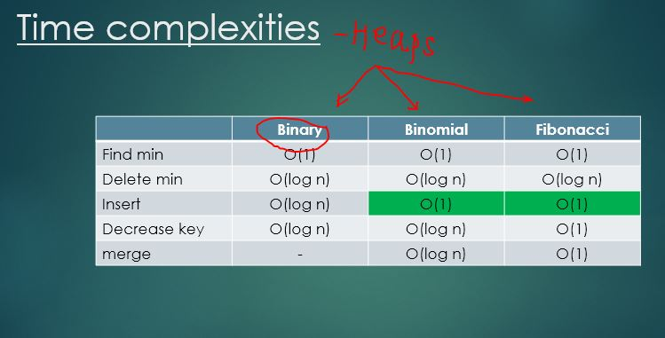
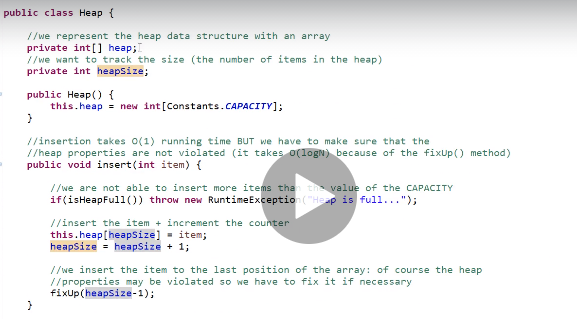
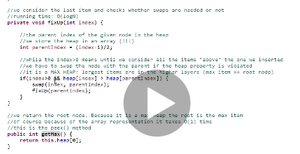
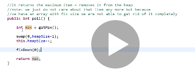
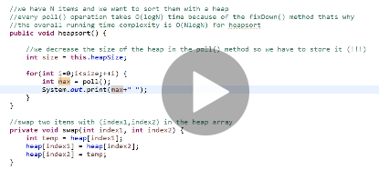
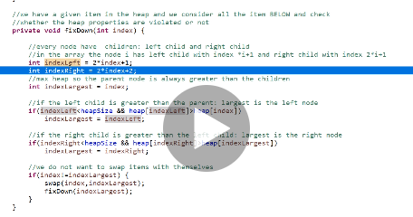
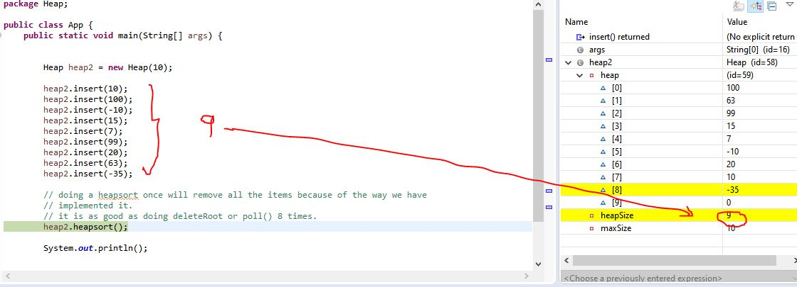
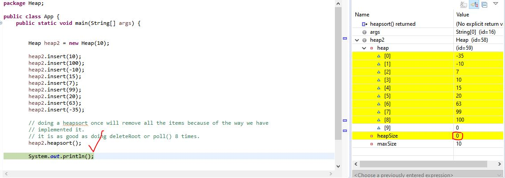

# Introduction

#### Heap Properties

Read about Heap Properties, Max Heap, Min Heap from Holczer balazs ppt, watch videos.

#### Max Heap

#### Min Heap

#### Applications

Heaps can be used to -
1. Perform Heapsort
2. Priority Queues can be implemented using Heaps. Priority Queues used in Graph applications, Dijkstra's shortest path algo and Minimum Spanning Tree algos rely on Priority Queues for boost

#### Advantage of Heaps

1. Heap v/s Tree:  
Find Max/Min in Heap is O(1)
Find Max/ Min in Tree is O(logN)

2. Using unsorted/ partially sorted arrays in Heaps:

find-min  (resp. find-max), delete-min (resp. delete-max) and insert are the three most important operations of a min-heap (resp. max-heap), and they usually have complexity of O(1), O(logn) and O(logn) respectively if you implement a min/max-heap by a binary tree.

Now suppose instead you implement a min-heap by a sorted (non-decreasing) array (The case for max-heap is similar). find-min and delete-min are of O(1) complexity if insert is not required in your application, since you can maintain a pointer p that always points to the minimum element in your array. When the minimum element is removed, you just need to move p one step to the next element in the array.

Dealing with insertion in a sorted array is not trivial. Given a new element e, we can use binary search to locate its position in the array to insert it. But the point is that if you want to insert it there, you have to move a lot of old elements (can be O(n)) around to make a vacancy for the new element to reside. This is quite inefficient for most applications. 

You may also choose to re-sort the array after an element is inserted, this requires O(nlogn) time however. Assumption is- Usually good sorting algorithms require around O(nlogn) time

So in totality we are looking at a time O(n)+ O(nlogn) for the purely sorted Array implementation. 

Conversely, a heap represented as an unsorted array has the advantage during insertion since it only needs to swap elements until heap properties are satisfied again. This takes only O(logn) time. Insertion is O(1). So in totality, we are looking at a time O(logN).

Also, find min, find max i.e get min or get max or get root will always be O(1) in both cases. Irrespective of whether the heap has been implemented using unsorted/partially sorted arrays or purely sorted arrays.

**Note:**
The last point, how you implement a data structure really depends on your application. NO single implementation is best for all cases. Analyze your application, find out the most frequent operations, and then decide the appropriate implementation.

**Note:** 
Heapsort still takes O(nlogn) time in Best, Avg, Worst cases as we see in the code even with the partially sorted/unsorted array implementation that we see in the code.
And it has O(1) Memory complexity.

**Note:**
Refer to Collections Project to see how java's Priority Queue collection can be used.

**Note:**
Refer to Check Heap Project. There we implement a short snippet to check if a given Min Heap is valid. This is one of the Interview questions discussed under Heaps.

**Note:**
Refer to Max to Min Heap. There we discuss the 2nd interview question to Design an algorithm that iss able to convert a minimum heap into a maximum heap.

#### Clarifications

What we have implemented here is the MAX Heap.
We have implemented the Heap Abstract Data Structure using an Array. So please think of insert/delete from an Array

Valid Heap is checked using HEAPIFY.
HEAPIFY is implemented here using fixUp() and fixDown(). Both implement HEAPIFY.
In cases of insertion, we HEAPIFY using fixUp() starting with the newly inserted node and then moving up.
In cases of deletion - i.e deletion of root, we HEAPIFY using fixDown() starting with the replacement root. By the way- if the root gets deleted, the new replacement root is the last element.

The Heap Sort which has been implemented as -

- HEAPIFY(fix Down)  -> this will not be needed for a valid heap uptil that point.
- SWAP LAST ITEM WITH ROOT
- NEGLECT THE LAST ITEM i.e that is the item bubbling out. This neglecting leads to sorting
- REPEAT

The fixUp and fixDown methods have both been written in a recursive fashion. 

For iterative approach for fixUp, fixDown see LinkedIn Learning code. But that does not yield accurate results. So we haven't included it here.

#### Functions

  - Insert - Insert an item. Inserts always happen to fill top-down, left to right.
 
  
 - Delete root - gets the root. root is Max in case of Max heap. and Min in case of Min heap.
 
 
 - Delete any item - mostly heaps are implemented for the very purpose that you will need to delete/get the root which is the max in max heap. So more important here is to delete the root.
 But any item can also be deleted by searching for it and deleting it. And following the same procedure we follow for Deleting the root. In the fixDown function pass the appropriate index of the deleted node.
 
 
 - getMax/getRoot- only gets the Max. more like peeking. does not delete it.
 
 
 - heapSort - Discussed above

#### Time Complexities of various Heaps

#### Code: Read Holczer Comments too.

#### Results

