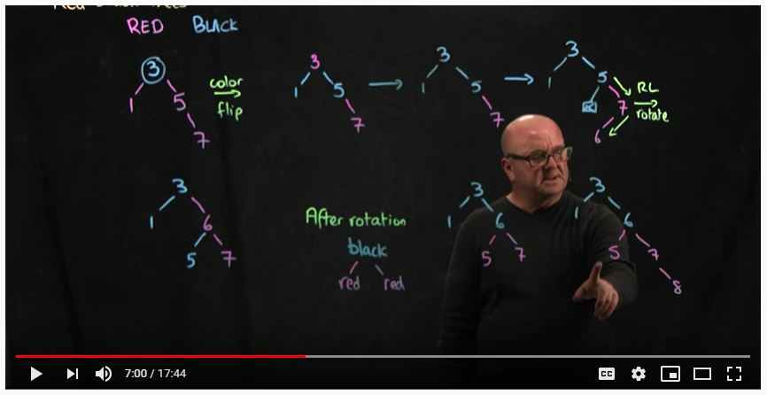
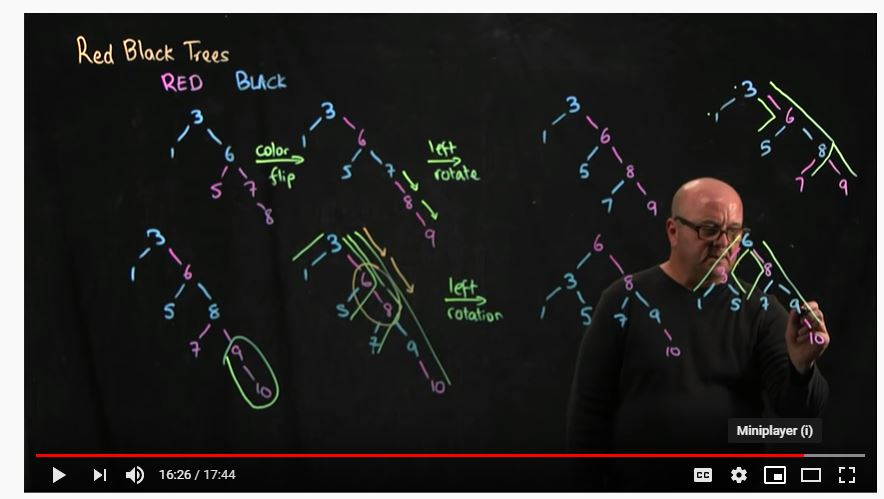
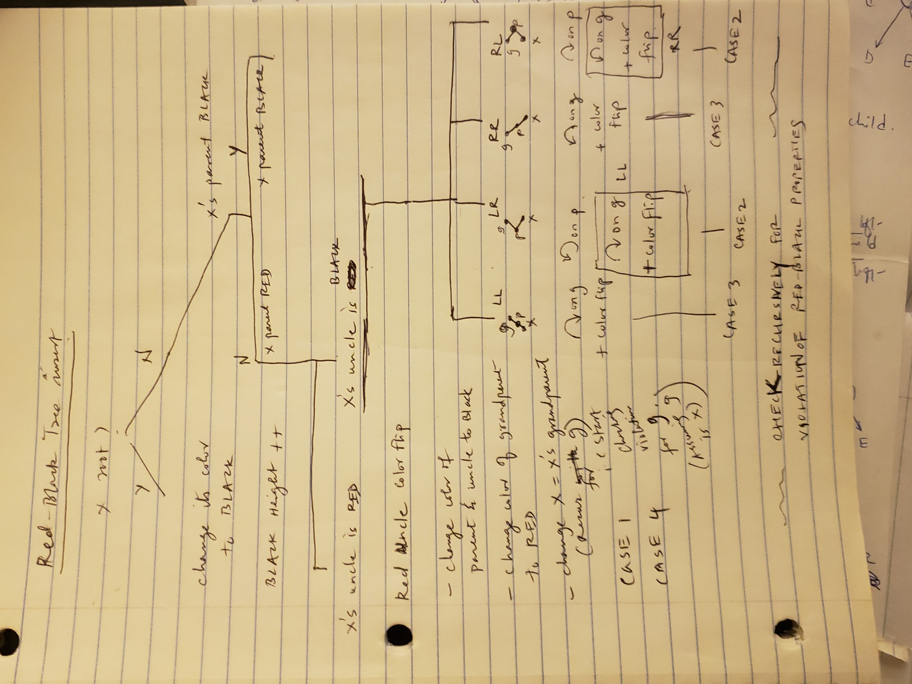
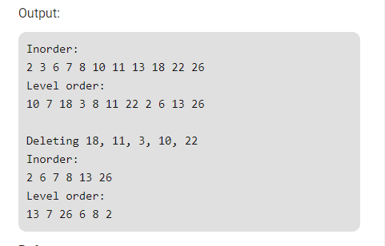

# RED BLACK TREES

####  For the 3 nodes in question, look how coloring changes after a Red Uncle, and after a Black Uncle

## Refer to

https://www.geeksforgeeks.org/red-black-tree-set-1-introduction-2/

https://www.geeksforgeeks.org/red-black-tree-set-2-insert/

https://www.geeksforgeeks.org/red-black-tree-set-3-delete-2/  - Has code in C++

### * BEST AND COMPLETE RECOURCE FOR DELETION : REFER TO TUSHAR ROY VIDEO AND CODE at 
https://www.youtube.com/watch?v=CTvfzU_uNKE
Code at https://github.com/mission-peace/interview/blob/master/src/com/interview/tree/RedBlackTree.java
In this code,
AtomicReference<Node> rootReference is like a double pointer c++, it is used to store the root because the root might change. We want to hold the new root in rootReference.

## Example

### Insert

### Delete

Expected Output of Red Black Tree deletion

