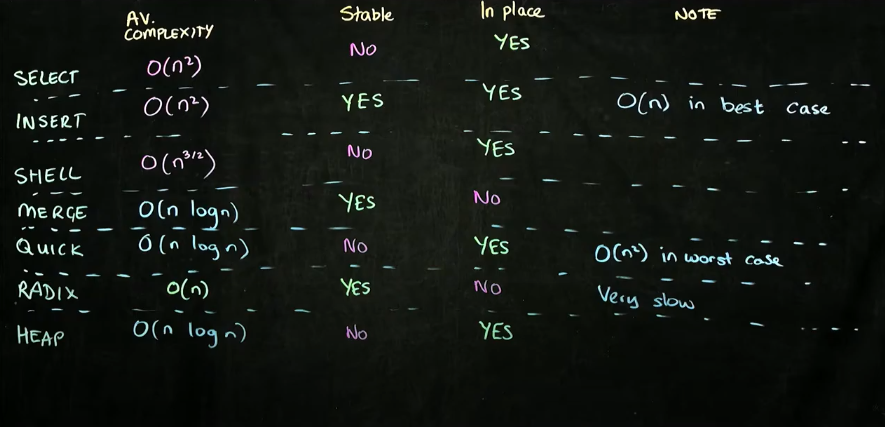

### See sorting videos from Youtube. SDSU Rob Edwards, and Holczer's videos

# Sorting:

1. Memory Complexity - 
2. Duplicates sorted in order of appearance in input list? -
3. Runtime complexity -

## Comparison Based Sorting Algorithms

### Adaptive and Non-Adaptive Sorting Algorithms
Comparison based sorting algorithms generally cannot do better than O(NlogN)
But if there are some presorted subsequences, we can take advantage and do close to O(N)

Heap Sort and Merge Sort do not take advantage of these presorted subsequences and hence are Non Adaptive.

But Insertion Sort and Shell sort are Adaptive algorithms that take advantage of presorted subsequences situation.

Bubble Sort
-----------
O(N^2)
Why named?: Smaller or Larger number bubbles out.

// Program for ascending sort - Holczer. So, Here the largest number bubbles to the last on every j iteration.

Algo in words:

Selection sort  
--------------
n-1 + n-2 + n-3 + .... + 1 = O(n(n-1)/2)= O(n^2) in all cases
Memory complexity = n
In place, stable
Why named: Lowest or Highest element selected and brought to the first position.

Algo in words:

Insertion sort  
--------------
Worst case = Outer loop = n, every Inner loop = n  -> Complexity = O(n^2)
Avg case = Outer loop = n , every Inner loop = let's say n/2 -> Complexity = n^2/2 = O(n^2)
Best case = Outer loop = n, every Inner loop = 1 -> Complexity = O(n)

Memory complexity = O(n)

In place, stable

Why named? Involves inserting elements in the appropriate places in the list.
Uses: Good in cases where we make a small addition to things that are already sorted. For eg. in databases.

Algo:

Shell sort
----------
Shell sort is a variation of insertion sort
Shell sort improves the average case performance of Insertion sort.
In place, NOT stable
When gap becomes 1, shell sort becomes insertino sort.

In worst case = O n^2
In average case Depending on the gap sizes and depending on who you ask, the average complexity is O(n^5/4) or O(n^3/2). THis does this by lessening the shift operations i.e iterations.
In best case O n

Why named?  After Shell who discussed it first

Algo:

Heap sort
----------
Always O(n log n)
Advantages: No extra copy of data needed. The initial array, sorted array and everything in between ends up in the same array.

Min heap is where parent is smaller then both children. 
Not necessary that left child is smaller than right.
Filling happens left to right.

Let's assume a min heap is given.
In general when heap is represented as an array, if parent's index is 'i', then left child index is '2i+1' and right child index is '2i+2'
Why named? Involves Heap, comes naturally from heaps

Algo

// swap min element at the top with the last element in the heap. 
// decrement size of heap by 1 i.e the last element now has come out of the heap.
// Correct the heap, in min-heap - parent should be lesser than the children.  So at every step check this.
// This correction will bring the min element to the top again. Repeat the steps

// Holczer's program is for MAX heap.

Merge Sorting
-------------
(Divide and Conquer)

Always O n log n  
n because n items need to be compared
and log n because you need to compare the n items to only log n items.

Stable
Out of place - Memoray complexity is O(n)

Algo:
Lets say I have a list to sort
What if I can sort half that list
What if I can half of that list?
...
1 numbers remaining - 1 number is always sorted

Now put the numbers together depending upon who is smaller or bigger.

Program:
Holczer implementation

Quick Sort
----------
(Divide and Conquer)

Avg. case = O(NlogN) - Fastest sorting algorithm in the average case.
Worst case - O(N^2) - when we alway choose the wrong pivot value on every iteration such that we do NOT divide the problem in 2 subproblems.

Why named?
Called quicksort because it is quicker than all the simple sorting algorithms (bubble sort, selection sort, insertion sort) described above, and also quicker than some advanced sorting algorithms depending on the algorithm and the data sorted.

Program:
Holczer implementation

## Hybrid Sorting Algorithms 
####(See Balazs video - great info)

QuickSort + Heap Sort = Intro Sort
Merge Sort + Insertion Sort = TimSort

# Non Comparison Based Sorting

Counting Sort
--------------
(See Balazs video - great info)
O (N+k)  --> Linear :)
Out of Place

Disadvantage: Only good when the variation in min and max values is less than  the number of values. i.e k is less than N.

Radix Sort
----------
O(N) in avg case. Watch Holczer and Rob Edwards SDSU.

Sort Summary
------------

