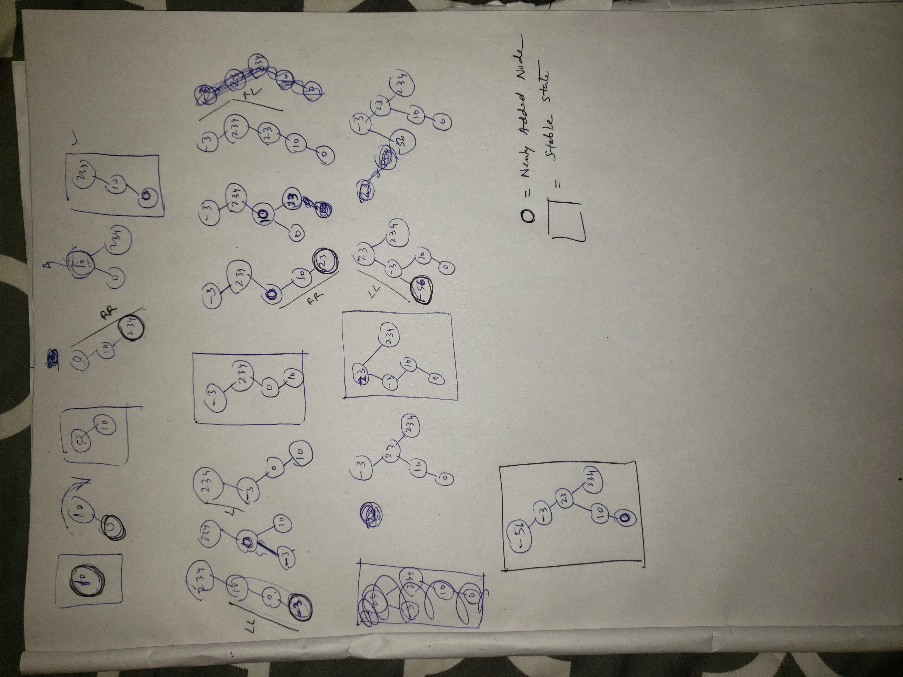

# Notes

A Splay tree is a self-adjusting binary search tree invented by Sleator and Tarjan. Unlike an AVL tree (or a Red-Black tree), the structure of the splay tree changes even after the search operation. It may become unbalanced.

1. We will splay, i.e cache for both insert or even find (find may be successful or unsuccessful). Delete can be implemented as you like. May be just normal BST deletion with 3 cases??

**Note** : We have implemented the recursiveInsert function to be as similar as possible to BST and AVL implementations. With that being said, you will be able to see where the changes are very easily. 

2. See the Node class for Splay tree. It has a pointer to its parent Node.

3. See how the SplayNode function itself performs all the adjustments of splaying and corrects the tree.

4. In the recursive approach, see how the recursion folds back taking only the 'most recent' node i.e the node on which the SplayNode function was called. 

5. See how the recursion is not responsible for setting any leftNode and RightNodes

6. See why we needed a parentNode variable. Reason: When the 'most recent' node was inserted, we needed to give it its parent. Hence we needed the parentNode variable. Alternatively, we could have passed along in the recursion a 3rd argument i.e parent of every Node, In that case insert would have looked like this-

	
	recursiveInsert(T newData, Node<T> node, Node<T> parentNode)
	

7. Also see how we need to tell its parent, whether the inserted node was left of right child of it. Why? Reason: because this parentNode.leftNode or parentNode.rightNode is used in the splayNode function.

So effectively, before passing the queried (found or newly inserted) node into the splayNode function, the following
design should be well defined.

        parentNode            parentNode           null             null
            \                     /                  \               /
            node                node                 node          node

If the parentNode of the queried (found or newly inserted) is null, then node is root node.

8. Verify all of these points 2-8 for the insert function  written using iterative approach. See how the while loop works in the find and iterativeInsert functions.

9. rotateLeft and rotateRight :**
What do the rotate functions exactly do?
a. Rotate on the nodeOnWhichRotationIsDemanded
b. Changes the link relationships between nodes but the names and their contents remain the same. Inside or Outside the function. Again, only connections/structure is changing.
c. A sophisticated Rotate may also update/fix the parent, left,right relationships of all the nodes in the group appropriately, following the rotation. In SplayTree we use sophisticated Rotate functions.  In AVL tree we use non-sophisticated rotate functions. Both functions perform the exact same rotate with the exact same piece of code. The only difference is that the sophisticated function, after finishing the rotations does updation of parent, left, right nodes for all the nodes in the group.
d. They may return the new root of the group. If return type is void, they wouldn't return it.
If they are returning the new root, the caller of this rotation may choose to use it appropriately.
e. Before rotation, nodeOnWhichRotationIsDemanded is the root.

**IMPORTANT: Please see this Working Example Until you Insert (-56) from the tester App.java**

	
10. Working with a real tree with Recursion and Iteration are both explored here, yielding same results. You will see the insert and find functions implemented in a recursive as well as iterative fashion. You will see anotherIterativeInsert function, which is a closer resemblance of the iterative insert to the recursive insert.

11.

12. **DO NOT** check your answer on https://people.ok.ubc.ca/ylucet/DS/SplayTree.html or any **REPLICAS** of this. These online visualizations do not handle negative values well.

12. What happens on Delete?

Some say that you can delete the node as usual, and then splay for the deleted node's parent. 
So the only change in the code would be to delete the node acc. to 3 cases and then call splayNode(node.getParent());

OR

As Explained on - https://algorithmtutor.com/Data-Structures/Tree/Splay-Trees/

**Delete**
To delete a node x, we do the following.
Split the tree that breaks it into S and T.
Remove x from the root of S.
Join T and S.
The pseudo-code is given below.

	SPLAY-DELETE(x)
		T, S = SPLIT(x)
		if S.left is not NIL
		 S.left.parent = NIL
		JOIN(S.left, T)

**Join**
Join operations joins two trees S and T such that all the items in S are smaller  than the items in T. This is a two-step process.
Splay the largest node in S. This moves the largest node to the root node having a  NIL right child.
Set the right child of the new root of S to T.
The pseudo code for join operation is given below.

	JOIN(S, T)
		if S == NIL
		 return T
		if T == NIL
		 return S
		x = TREE-MAXIMUM(S)
		SPLAY(x)
		x.right = t
		t.parent = x
		return x

**Split**
The split operation at node x divide the tree into two trees T and S such that all  the elements in T are smaller than or equal to x and all the elements in T are  greater than x. This is also a two-step process.
Splay x. This moves the x to the root of the tree.
Split the right subtree T from the rest of the tree T.
The pseudo code for split is as follows.

	SPLIT(x)
		SPLAY(x)
		if x.right is NOT NIL
		 T = x.right
		 T.parent = NIL
		else
		 T = NIL
		S = x
		S.right = NIL
		x = NIL
		return S, T
		
     	
**Advantages and disadvantages of Splay Trees**
Following are the advantages of splay trees over other binary search trees.

1. In an amortized sense, ignoring constant factors, they are never much worse than constrained structures, and since they adjust according to usage, they can be much more efficient if the usage pattern is skewed.
2. They need less space since no balance or other constraint information is stored.
3. Their access and update algorithms are conceptually simple and easy to implement.

Following are the disadvantages of splay trees.

1. They require more local adjustments, especially during accesses (look-up operations). (Explicitly constrained structures need adjusting only during updates, not during accesses.)
2. Individual operations within a sequence can be expensive, which may be a drawback in real-time applications.