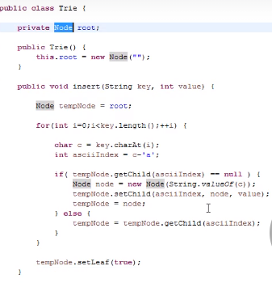
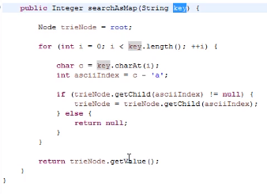
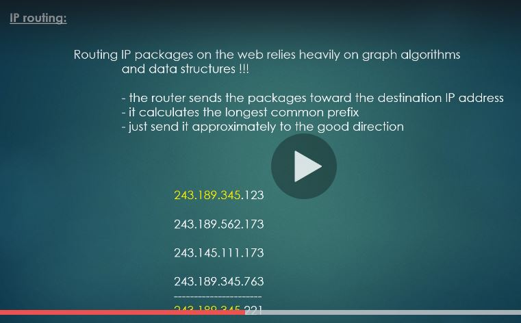
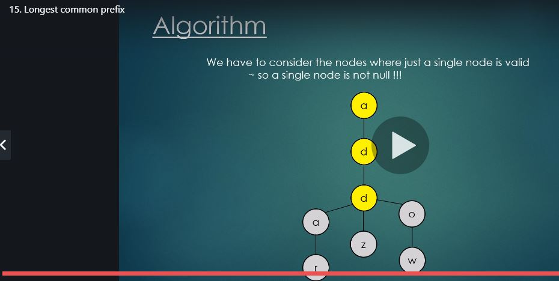

# Tries

**Note:**
The way we have implemented the Trie here, each node has 26 children and the position is based on the alphabetic order. So insert logic etc. does not have to compare the characters.

**Note:**

Here,

key = word

**Note:**

	if (!(trieNode.isLeaf())){
	return false;
	}  
	
	// if you want to be able to say
		whether that exact word was inserted in the Trie, but not its substring , 
		then add the above snippet in the search function, just before returning true

For eg:

- In the current testing, adding this snippet would have returned false on checking it 'sh' is present. Because 'sh' was not a word that was inserted by itself. It was insert as part of 'she'
		
- But this is not how tries are implemented. So we have commented the above snippet part out in the search function.
		
- So Tries generally return true for all substring matches also. i.e searching for 'sh' also yields true.
		
		
		
**Note:**

Tries can be used as HashMap/Hashtables also. 

Instead of inserting only the key, also insert the value associated with the key. See below and understand that the way we have implemented insert, we are inserting the same key for every letter of the key.

i.e for insert("she", 5)

We are inserting-  
                   
       s-5
		 |
		 h-5
		 |
		 e-5
								 
This is because this was the easiest path to take from the current Trie implementation.
But that is not our purpose.

We just want to somehow associate the value 5 to the key "she"

Another point to note is that a Trie cannot not act as a generic hashMap/ hashtable because, the key always has to be a String. In a generic hashtable/hashmap the key and value both can be any Object.

**Note:**

Don't forget how we have implemented the Autocomplete feature.

**Note:**

Sort = Passing an empty string i.e "" prefix to the Autocomplete feature i.e to the allWordsWithPrefix(String prefix)  function.

The DFS in collect function will return all the words in the correct (ASCII) order. 

Because that is how they were placed in the first place.  See how the sort function is a ditto copy of the allWordsWithPrefix function.

**Note:**

Tries are used in the Internet Infrastructure in IP Routing where Longest Common Prefix matching in IP addresses is used to route packets to the appropriate neighbor router.

